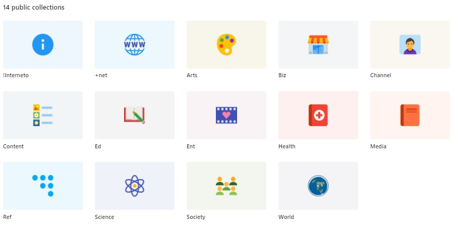

# Interneto links
Interneto links is a free collection / directory / OSINT (open source intelligence) of categorized webs (around 33k webs).
The directory is structured in !Interneto (info folder) + 13 main categories with subcategories inside where are accordingly stored the links. These links are homepage sites like https://subdomain.domain.tld/. Also there are two  specific categories: one for content of websites (audios, books, news) saved in the "Content" and public users of platforms (content creators) in "Channels & Profiles". Besides there are hashtags to facilitate the search.

**Interneto** = **In** + **Ter** + **Net** + **O** = **In**side of the **Ter**a (1 trillion) networks circular closed connections (**O**)
- **In**: inside
- **Ter**: tera = 
- **Net**: networks
- **O**: circular closed connections

Accounts:
- Hosted in [raindrop.io/interneto](https://raindrop.io/Interneto)
- Twitter: [@InternetoOK](https://twitter.com/InternetoOK)

## Explanation

This project came from the idea of getting a free accessible categorized database of all internet sites. Right now (2021/12/22) there are 1,914,441,355 webs however less than 200 million are active, around 80% of websites are inactive by parked domains or similar.
Data from:
- [Total number of websites](https://www.internetlivestats.com/total-number-of-websites/)
- [Web Server Survey - Netcraft News](https://news.netcraft.com/archives/category/web-server-survey/)
- [Majestic million](https://majestic.com/reports/majestic-million), first million domains with the most referring subnets.

Categorize 200 million dynamic websites that born and die is almost impossible but the main idea is to create a big list of functional  and relevant webs in a classification system. Two main project have committed to do this work in the past: [DMOZ (Directory of Mozilla)](http://dmoz-odp.org) and [Curlie (Collector of URLs)](http://Curlie.org), however DMOZ closed in 2017 and Curlie.org is very inactive.

In addition, nowadays with the improvement of search engines the web directories have been abandoned because of the trending of search engines with quick answers like Google, DuckDuckGo, Bing, Yandex... But web directories are still great alternatives to search engines for various reasons:
- Does not consume energy of the servers.
- Does not use your privacy to target with ads and extract information.
- Have a big list of webs about the same topic.
- It is not sorted by marketing, ads or SEO position instead of search engines do. 
- It is totally free as always you have a local database of links.
- You can download all the links and manage locally. 

The main issue about web directories is the way to search information, its hierarchical structure with categories and subcategories difficult the process of searching. Therefore, all efforts should be focus towards improving the quality of the directory structure. For that reason is necessary some tool that permit to categorize, organize and display content in a good way.

The most popular search engines in terms of proportions. The spider represents the web crawler, the AI bot that index the Web.
- Google: 92.2% head of the spider controls the web
- Bing (also Yahoo!): 3.77% from Microsoft one the biggest corporation
- Baidu: 1.45% a big Chinese internet company
- Yandex: 0.68% a big Russian internet company
- At the bottom are represented the search engines that cares for your privacy, like DuckDuckGo (0.59%), Startpage, Qwant, PrivacyWall, YaCy (DAPP search engine). If you want to use the power of the spider you have to sell your soul.

## Classification system

14 main categories:
- !Interneto -> Info of the Interneto project
- +Net -> Internet related sites.
- Arts -> Arts related web and platform sites.
- Business -> Business and companies sites.
- Creators -> Public content creators of platforms, like individuals, teams, projects, companies, etc.
- Content -> Interesting audio, articles, images and video content of the internet.
- Education -> Education sites.
- Ent -> Entertainment sites.
- Health -> Health sites.
- Media -> Blogs, magazines and newspapers of all topics.
- Reference -> Reference sites of the internet.
- Science -> Science related websites.
- Society -> Sites related to society.
- World -> World and regional sites.

### Problem with classification
For example Google has topics in many sections like: +Net, Arts, Business, Education, Media, Society, World. How do we categorize the Google webs, by the platform, the owner company, its use or the topic? 

The general "Google" folder is inside "Business – Enterprises – Internet – Communication", 4th steps inside the parent folder. If we organize by topics, the webs would be moved to different folders:
- **Google blog** in Media – Blogs Media – Software Blogs
- **Google maps** in World – Maps – Earth
- **YouTube** in +Net - Content – Video - Video Platform

But if we organize by company name, it won't be a section categorized by topic or platform. To solve this problem arises the _Tags_, to group links by another topic and maintaining the folder structure, such us:
- \#Google, \#Maps, \#Video-platform
	
For me the best way to classify webs is to organize by topic or use, and then add the correspondent tags like \#Company: Google
And if you want to reuse a link it would be good to create a shortcut with the path folder or group by tags.

The ways of sorting can be:  
- 2D either with columns, keys, circles, lists, trees.  
- 3D (with the use of shadows and colors).
- Sorting by:
	- alphabetical order
	- color used
	- date of creation
	- loading speed
	- number of words
	- number of visits
	- region
	- score
	- server consumption / server type
	- similarity between logos
	- storage
	- subject
"If a mind analyzes all possible parameters occurring in a day the size of the mind to process it would be one light year in diameter."
	
## Target
With a big list of categorized selected links, you can create a web directory very useful to understand better the digital world and also you can investigate and extract better information using this system.

The main problem is that the classification system and the knowledge is a personal thing. For that reason it would be great to create a bookmark manager based on your thoughts to satisfy them.

## Next step: [interneto manager app](https://github.com/interneto/interneto-manager)
